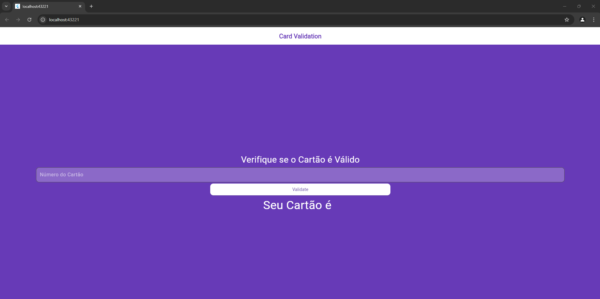
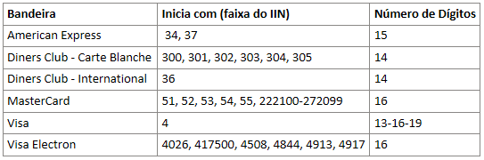

# Validador de cartão de crédito


## Descrição

Este projeto é um validador de cartões de crédito desenvolvido em flutter que utiliza expressões regulares para identificar diferentes bandeiras de cartões e o algoritmo de Luhn para verificar a validade dos números dos cartões.

## Validação de Cartões

A validação dos cartões é feita em duas etapas:

1. **Identificação da Bandeira**: Utilizamos expressões regulares para identificar a bandeira do cartão com base no número fornecido.
2. **Algoritmo de Luhn**: Após identificar a bandeira, aplicamos o algoritmo de Luhn para verificar se o número do cartão é válido.

### Bandeiras Suportadas

- American Express
- Diners Club - Carte Blanche
- Diners Club - International
- MasterCard
- Visa
- Visa Electron
- Elo
- Hipercard

## Regras de Validação

As regras de validação para cada bandeira de cartão são baseadas na faixa do IIN (Issuer Identification Number) e no número de dígitos. A imagem abaixo mostra as regras utilizadas:



## Estrutura do Projeto

- `lib/utils/card_validate.dart`: Contém as funções de validação de cartões, incluindo as expressões regulares para identificar as bandeiras e o algoritmo de Luhn.
- `lib/pages/home_view.dart`: Interface do usuário para entrada do número do cartão e exibição do resultado da validação.

## Como Executar

1. Clone o repositório:
   ```sh
   git clone https://github.com/seu-usuario/CardValidate.git

2. Navegue até o diretório do projeto:
    ```sh
    cd CardValidate
    ```
    
    

3. nstale as dependências:
    ```Dart
    flutter pub get
    ```
    

4. Execute o aplicativo:
    ```Dart
    flutter run
    ```


## Referências
- [Documentação do Flutter](https://flutter.dev/docs)

- [Algoritmo de Luhn](https://en.wikipedia.org/wiki/Luhn_algorithm)


Este README.md fornece uma visão geral do projeto, explica como a validação é feita, lista as bandeiras de cartões suportadas, descreve a estrutura do projeto e inclui instruções sobre como executar o aplicativo. Além disso, faz referência à imagem `Regras.png` localizada na pasta `assets`.
